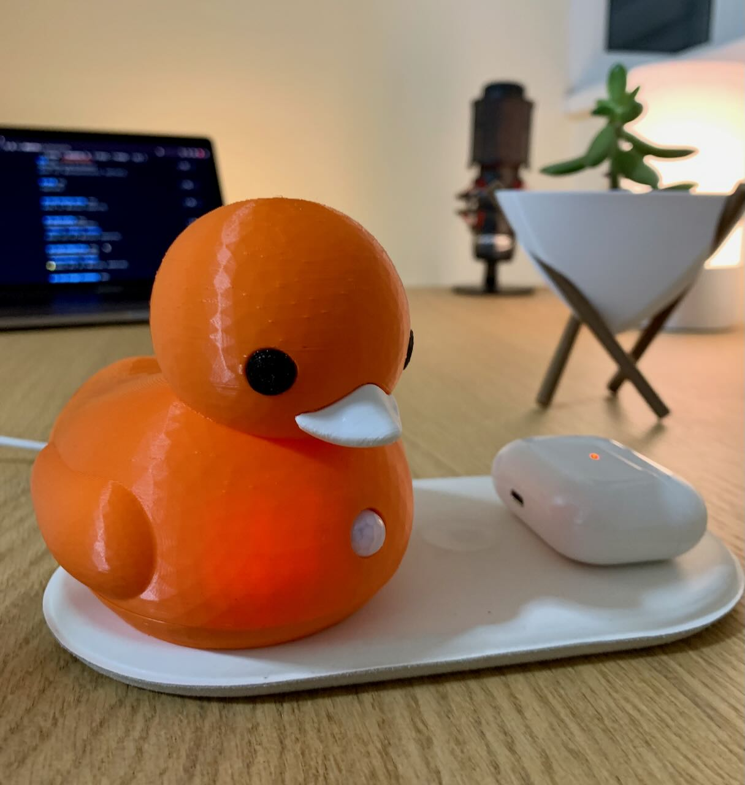
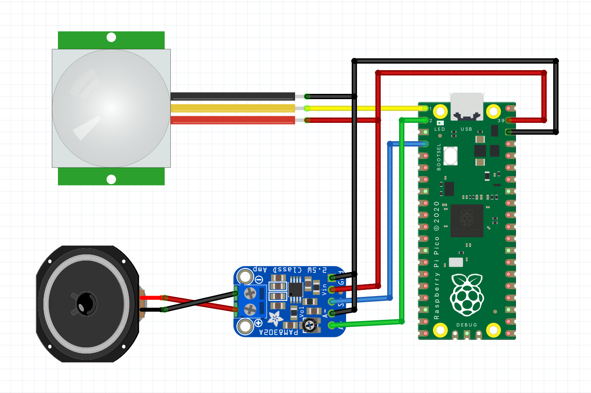

# The Guardian Duck
An inconspicuous device which quacks when motion is detected. The duck is powered by a battery and supports the Qi wireless charging.



## Hardware

### Bill of materials
* Raspberry Pi Pico
* PIR Motion Sensor (HC-SR505)
* Audio Amplifier (PAM8302)
* Mini-Speaker
* LiPo SHIM for Pico
* Battery LiPo 600mAh
* Qi receiver module - Micro USB

### Print
The 3d model can be downloaded from my Printables [here](https://www.printables.com/social/306904-dmytro-panin/models).

## Software
The software is written in CircuitPython and tested with the version 7.3.1

### Installing CircuitPython
1. Download the CircuitPython UF2 from the official website [here](https://circuitpython.org/board/raspberry_pi_pico/).
2. Push and hold the BOOTSEL button and plug your Pico into the USB port of your computer. Release the BOOTSEL button
   after your microcontroller is connected.
3. It will mount as a Mass Storage Device called RPI-RP2.
4. Drag and drop the CircuitPython UF2 file onto the RPI-RP2 volume.

### Software installation
Download and copy the software

```shell
cd ~
git clone https://github.com/dr-mod/roman-duck.git
cp roman-duck/src/* <CIRCUITPY DRIVE>
```

### Assembly

1. Solder the LiPo SHIM to Pico
2. Connect the peripherals as per the schematics 
3. Connect the battery to LiPo SHIM
4. Attach the Qi pad to the inner side of the duck's bottom part with double-sided adhesive tape
5. Insert the rest of the components to the duck's upper side
6. Connect the Qi pad to Pico and the duck's parts together

### Support the project

If you would like to support what I do and keep me caffeinated, you can do it here:

[](https://www.buymeacoffee.com/drmod)
